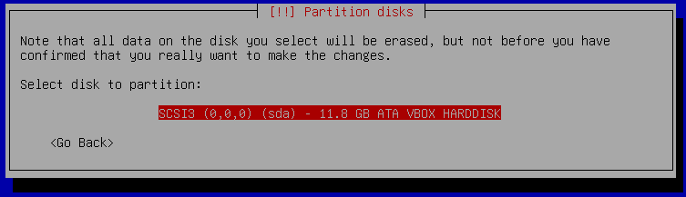
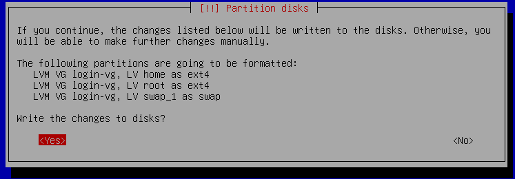
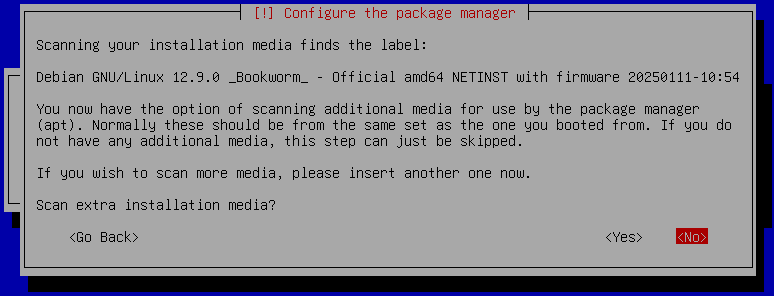
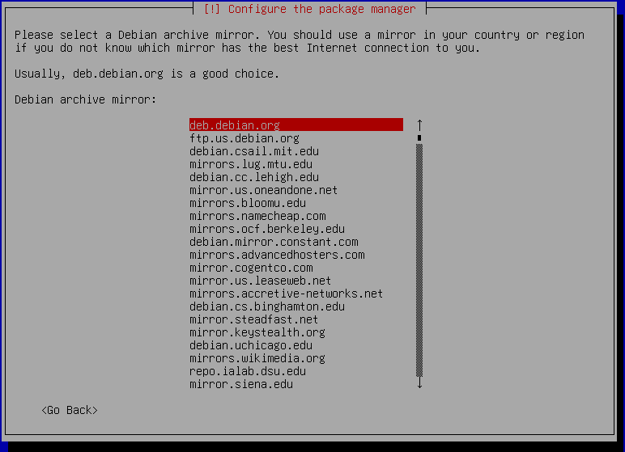

# DEBIAN

Premise: there won't be much of a theory explained here, but every command and/or section's name is a good hint of what you should lookup on the Internet, with `man` command or by using `<command> --help`

Any reference to the `host` machine means the physical machine that you're using to run the VM.
Any reference to the `guest` machine means the virtual machine that you're using.

## Download ISO

https://www.debian.org/distrib/

The `small installation image` is all we need. Version downloaded is [`debian-12.9.0-amd64-netinst/ 64-bit PC netinst ISO`](https://cdimage.debian.org/debian-cd/current/amd64/iso-cd/debian-12.9.0-amd64-netinst.iso). Other versions might be slightly different.


### Set up the network on VM settings

By default, the VM will be connected to the `NAT` network. NAT (Network Address Translation) is a technique that allows a computer to share an IP address with another computer on the same network. So The VM would use the same IP address as the host machine. This is not what we want. We want the VM to have its own IP address. To do that, we need to set up the network settings on the VM settings. Go to the settings and select the network tab. Then change the `Adapter 1` to `Bridged Adapter`.


### Mandatory
#### Install


##### Select your preferences

1. Choose the language
2. Choose the location
3. Choose the keymap

##### Configure the network

1. Set up the hostname with your `<login>`.

2. Set up the domain name. You can leave it to default, which is provided to you by your router. Or you can set it to blank.

##### Set up users and passwords

###### Root

Set up the root password.

1. Set up the root password and confirm it.


###### User

Set up the user with your `<login>` and password.

1. Full name: up to you
2. Username: your `<login>`
3. Password: password

##### Configure the clock

Set up the time zone.

##### Partition disks

You can either do it manually or you can use the Guided Partitioning Tool. I prefer the latter because it has all necessary options.

1. Choose the partitioning method.
	
2. Select the disk to partition.
	
3. Choose the partitioning scheme. We need to separate the `/home` and `/` partitions. So the second choice is the most suitable.
	
4. Confirm the overwirte of the partition table.
	
5. Choose the encrpypted partition's passphrase. **Attention**: the passphrase is case-sensitive and you cannot change it. It should be quite long (write it down somewhere). Then confirm it.
	
6. Choose the partition's size. I prefer to use the entire disk space.
	
7. Confirm the partitioning and write the changes to the disk.
	
8. Confirm the changes.
	
##### Install the operating system

Wait for the installation to finish.

##### Configure the package manager

###### Installation media

Skip if the sections shows up.


###### Archive mirror country

Choose the country closest to you. Still any country is fine. I'll be using the `United States`.



###### Proxy

Skip.


##### Configuring popularity-contest

Skip. Or if you want to, you can enable it.


##### Software selection

1. Remove any option of the `Debian desktop environment` section and choose `SSH server` and `Standard system utilities`.
	

##### Configuring grub-pc

In order to boot the system, you need to configure the boot loader. The boot loader is responsible for loading the kernel and choosing+loading the operating system.


##### COMPLETE


---

#### MAIN SETUP

First of all, you need to log in to the system. After inserting the crypted partition password, you should be able to see the login screen. Use your `<login>` and password to login.

P.s. remember that the system's services configuration should be edited by users with higher privileges than the standard. So you should be using the `sudo <command>` (super user do; run as root) command to edit the configuration files, or switch to the root user with the `su -` (switch user; without any username specified it will try to login as root. `-` is needed to update the working directory to the switched user's home directory and update the environment variables) command and do everything with the root user.

---

##### Switch to root user

**For simplicity**, I'll be using the `su -` command to switch to the root user.

```bash
su -
```

and enter the root password.

```bash
<root-password>
```

---

##### UFW

[`UFW`](https://wiki.ubuntu.com/UncomplicatedFirewall) (Uncomplicated Firewall) is a firewall that is easy to configure and manage. A firewall is a security system that monitors and controls incoming and outgoing network traffic based on predetermined security rules. It acts as a barrier between a trusted internal network and an untrusted external network, such as the Internet. So it's a good idea to use it.

###### Install

You can install it with the following command:

```bash
apt install ufw
```

###### Configure

Enable the firewall with the following command:

```bash
ufw enable
```

###### Configure the firewall

The services that need to be allowed from the outside are `ssh`.

To allow ssh you can use the `ufw allow ssh` command, but this alias is set up for the default port which is `22`. So to allow the custom port (`4242` is required) you have to use the following command:
```bash
ufw allow 4242
```

##### SSH

Starting with [`SSH`](https://www.techtarget.com/searchsecurity/definition/Secure-Shell) (secure shell) will be useful for the following reasons:
- By remotely accessing the system, you'll have a more useful shell and you'll be able to copy-paste text from the host (physical machine) to the guest (virtual machine).

###### Install

It should be already installed, because of the installation of the `standard system utilities` + `SSH server` in the previous step. But if you want to install it manually, you can do it with the following command:

```bash
apt install openssh-server
```

###### Configure

The configuration file is located in `/etc/ssh/sshd_config`.
You can configure the SSH server with the following any text editor. I'll be using the `nano` command.

1. Open the configuration file with the following command:

	```bash
	nano /etc/ssh/sshd_config
	```

2. Configure the following options by uncommenting them if commented out and set the values accordingly:

	```ini
	#...
	# Listen on port 4242
	Port 4242
	# Listen on from any IP address
	ListenAddress 0.0.0.0
	#...
	# Deny access with root login
	PermitRootLogin no
	```
	Save and exit the editor. (CTRL + S and then CTRL + X)

3. Restart the SSH server with the following command:

	```bash
	systemctl restart sshd
	```
	or
	```bash
	service sshd restart
	```

4. Check the status of the SSH server with the following command (it should be `active (running)` and you should be able to see the `listening on 0.0.0.0 port 4242` message):

	```bash
	systemctl status sshd
	```
	or
	```bash
	service sshd status
	```

###### Connect to the VM

To connect to the VM via ssh, you can use the following command:

```bash
ssh <login>@<ip-address> -p <port>
```

`<login>` is your `<login>` and `<ip-address>` is the IP address of the VM.
The `<port>` is the port that the SSH server is listening on. So in this case it would be `4242`.
To find the IP address, you can use the following command:

```bash
hostname -I
```
or you can use `ip` command.

```bash
ip a
```

The first one will show you the IP address of the VM, the second one will show you all the network interfaces and their details.

So from any machine in the same network as the VM (because of the bridged adapter), you can connect to it now from the host machine.

Example:

```bash
ssh login@10.10.250.200 -p 4242
```

##### Sudo

The [`sudo`](https://www.sudo.ws/sudo/intro.html) command allows a user to execute a command as the superuser (root).

###### Install

You can install it with the following command:

```bash
apt install sudo
```

###### Configure

The configuration file is located in `/etc/sudoers`.

- You can configure the sudo with the following any text editor.
- Or you can use the `visudo` command.

This would be the configuration file:

```apacheconf
# Reset environment variables (only for the running command) on each sudo command execution
Defaults	env_reset
# Send a mail to the users's specified email if the running sudo does not enter a valid command
Defaults	mail_badpass
# Limit the $PATH variable for sudo command
Defaults	secure_path="/usr/local/sbin:/usr/local/bin:/usr/sbin:/usr/bin:/sbin:/bin:/snap/bin"

# https://stackoverflow.com/a/4426291
Defaults	use_pty
# requiretty is used to prevent sudo from running on a non-interactive terminal (e.g. a script)
Defaults	requiretty

# When sudo requires a password, set the max number of tries to enter the password
Defaults	passwd_tries=3
# If the user enters an incorrect password, the sudo command will exit with an error message (insults)
Defaults	insults

# Every time sudo is run, the log file will be updated with the run command.
Defaults	logfile="/var/log/sudo/sudo.log"
# The directory where the sudo log file will be stored
Defaults	iolog_dir="/var/log/sudo"
# What to log
Defaults	log_input,log_output

# The time after which the sudo commands will request a password again
Defaults	timestamp_timeout=15

# The root user is allowed to run any command
root		ALL=(ALL:ALL) ALL

# The %sudo group is allowed to without password the ls, apt-get and apt commands
%sudo		ALL=(ALL:ALL) NOPASSWD: /bin/ls, /usr/bin/apt-get, /usr/bin/apt
# The %sudo group is allowed to run any command except the rm and su commands
%sudo		ALL=(ALL:ALL) ALL, !/bin/rm !/bin/su

# Include the `/etc/sudoers.d` directory if there are extra configuration files
@includedir /etc/sudoers.d
```

###### Add the user to the sudo group

To add the user to the sudo group, you can use the following command:

```bash
usermod -aG sudo <login>
```
where `<login>` is your `<login>`.

To check if the user is in the sudo group, you can use the following command:

```bash
groups <login>
```

##### Password policy
